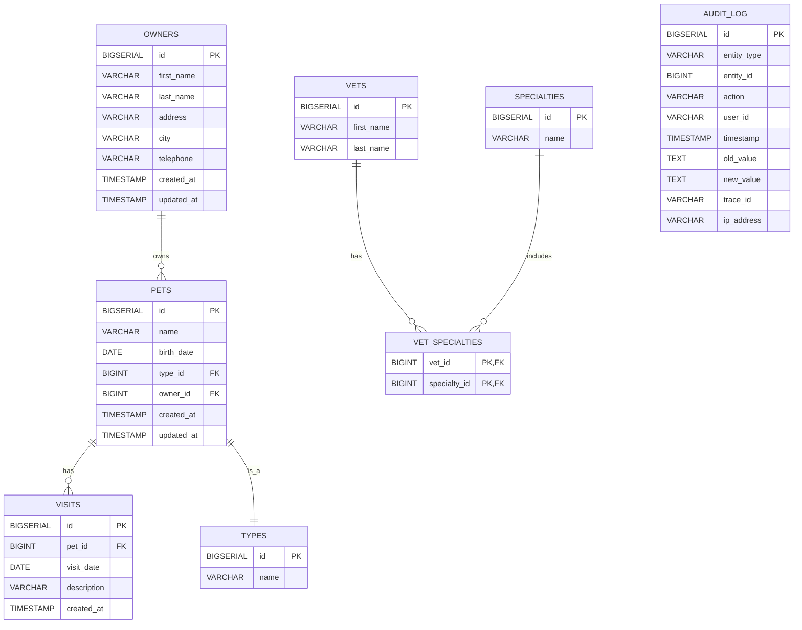

# Entity Relationship Diagram (ERD)

The following diagram illustrates the PostgreSQL database schema for the migrated Petclinic application.

## Schema Improvements (vs Legacy)

1. **Scalability**: All Primary Keys upgraded to `BIGSERIAL` (64-bit integers).
2. **Partitioning**: `VISITS` and `AUDIT_LOG` tables are partitioned by date range to handle high volume.
3. **Data Integrity**: Added `ON DELETE CASCADE` constraints and `CHECK` constraints (e.g. birth_date <= current_date).
4. **Compliance**: Dedicated `AUDIT_LOG` table for tracking all sensitive CRUD operations.
