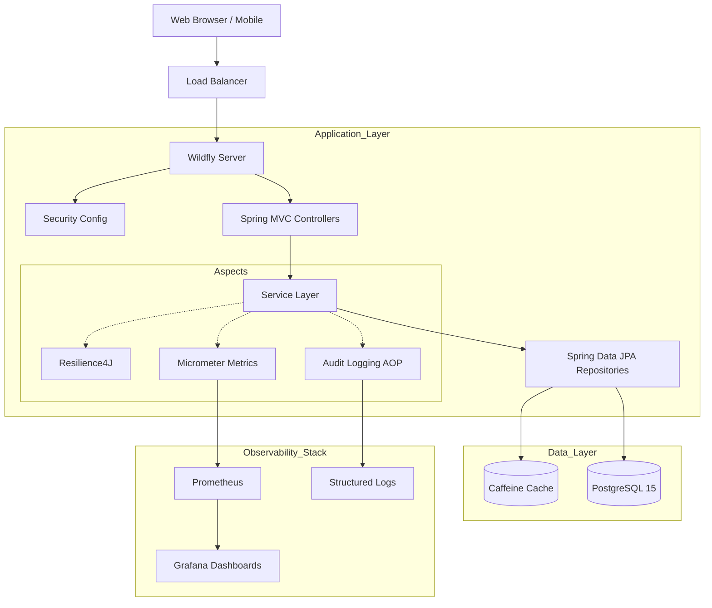

# High Level Design (HLD)

## Architecture Overview

The modernized Petclinic application follows a layered architecture pattern, enhanced with Resilience and Observability aspects.

## Configuration Externalization

All major configuration (database, cache, JPA, resilience, observability, etc.) is externalized in `src/main/resources/application.properties`. No sensitive or environment-specific values are hardcoded in Java code. See the properties file for details.

## Key Components

1. **Web Layer**: Spring MVC with Bootstrap 5 JSP views. Handles user interactions and input validation.
2. **Service Layer**: Business logic implementation. Transaction management, Resilience policies (Circuit Breaker), and caching logic reside here.
3. **Repository Layer**: Spring Data JPA interfaces for database interaction.
4. **Data Layer**: PostgreSQL 15 for persistent storage, Caffeine for high-performance in-memory caching.
5. **Observability**: Sidecar processes collect metrics (Prometheus) and trace distributed transactions (OpenTelemetry).
