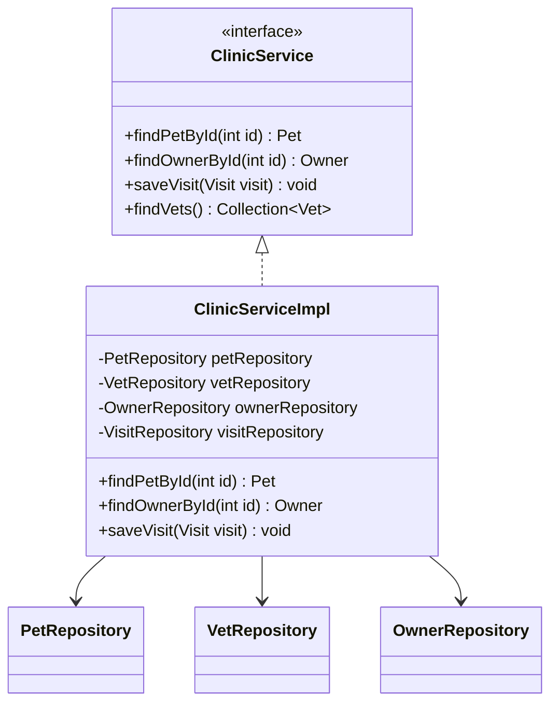
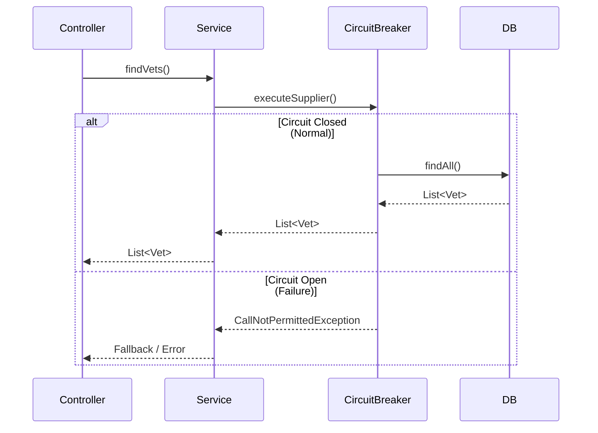
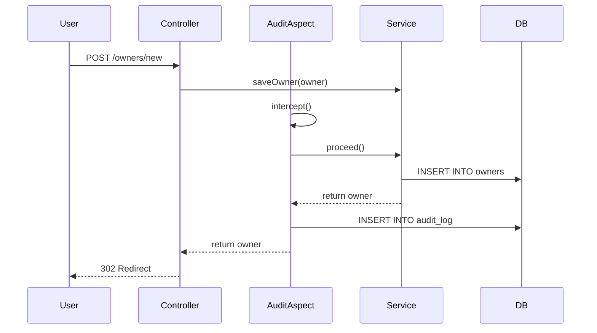

# Low Level Design (LLD)

## Service Layer

The service layer implements the Facade pattern through `ClinicService`, which delegates to specialized Repositories.

## Configuration Externalization

All configuration (database, cache, JPA, resilience, observability, etc.) is externalized in `src/main/resources/application.properties`. No sensitive or environment-specific values are hardcoded in Java code. See the properties file for details.

## Resilience Strategy

Circuit Breakers are applied at the Service layer to protect against database or external system failures.

## Audit Logging Flow

Audit logging is implemented using Spring AOP around transactional methods.

1. **Intercept**: `@Around` advice intercepts methods annotated with `@Transactional`.
2. **Extract**: Captures method arguments (Entity) and Principal (User).
3. **Log**: Writes an `AuditLog` entry to the database within the same transaction.

